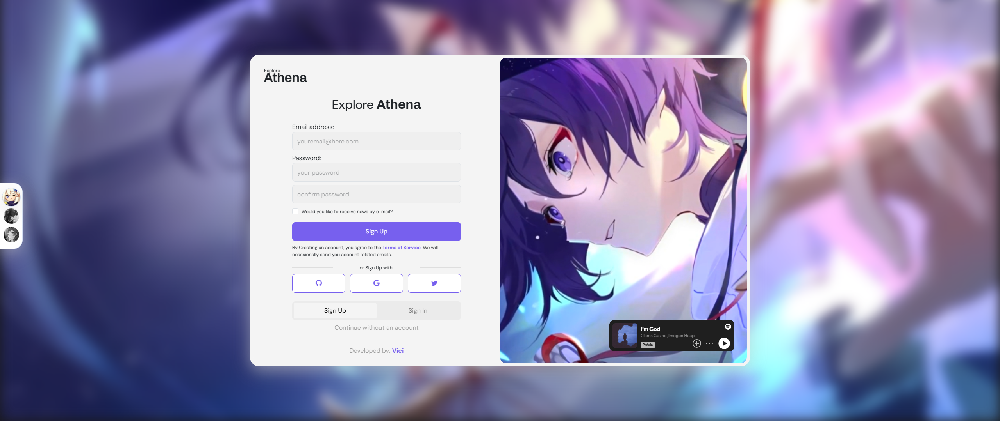
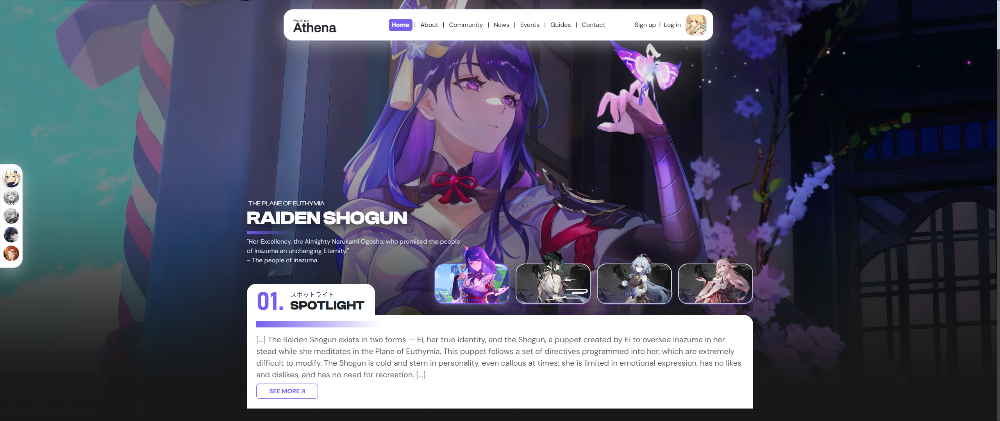
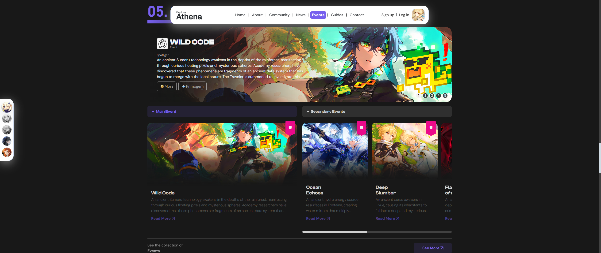
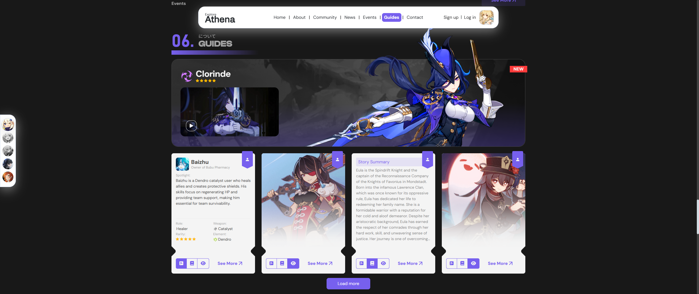

# reAthena | Current Version: v0.14b.

## About the Project

reAthena is a project created for the geek community, the ultimate guide where you will find everything about the latest games. From tips to master your favorite characters to unbeatable strategies to complete challenging events, reAthena is here to transform your gaming experience.

The games we cover include: Genshin Impact, Honkai Star Rail, and Zenless Zone Zero. Explore the gaming world with reAthena and become a true master in your favorite titles.

Named after Athena, referencing the Greek goddess. As the project is conceived as a forum, gathering information from various areas, it's only fitting to be accompanied by a name that refers to wisdom.

Currently, you can access the project through the Vercel platform: https://re-athena.vercel.app/, where it is currently hosted.

## Features:

### Initial Page

The project currently includes several features:

An Index page, where users can choose their game through a side menu and log in or register, but if preferred, they can browse without an account.

### Main Page

The main page contains several idealized sections such as:

#### Home

In this section, users can see the presentation of the current featured character, which is currently Raiden Shogun from Genshin Impact. Below her image, there is also a brief descriptive text. The page also features a carousel with other highlighted characters.

#### Events

Here, current in-game events are presented. You can also view some components that were exclusively programmed for this page, such as the side carousel, where users can scroll through items using just the middle mouse button. There is also a dynamic carousel that automatically changes information after a few seconds.

#### Guides

My favorite section, where I present details about characters, weapons, artifacts, and other elements related to the game in question (the image shows Genshin Impact). Each card presents technical information about the character, their story (lore), and an animated gif taken from the original game itself. Each card will take the user to the main page of the respective item.

---

**reAthena** is not yet complete. I intend to continue developing it until it reaches its peak.
**reAthena** is in continuous development, with new features and improvements as I advance in my studies.

---

*O **reAthena** está em constante evolução.*